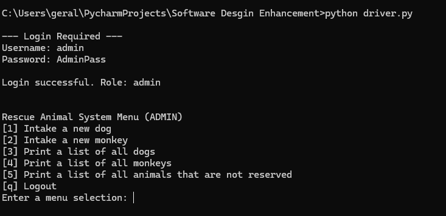
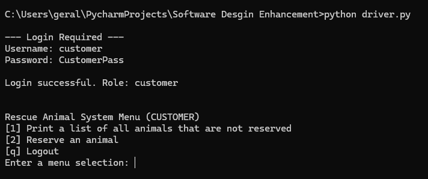
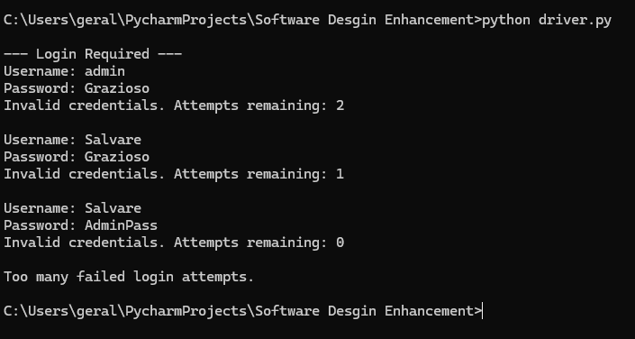

This artifact is from my IT-145 Foundation in Application Development class that I took about two years ago. The concept of this project was that the company, Grazioso Salvare, uses dogs and monkeys as search and rescue animals, and put the animals in training prior to being in service. I chose this artifact because I thought it would be the best one to use to effectively show my skills and complete the course outcomes for all five of the enhancements. Rather than making small enhancements across three different projects, I liked the idea of taking one project that was extremely simple and lacked security, logic, and long-term storage, and fixing these problems by the end of all the enhancements.  

I met the course outcomes that I planned by having a security mindset and adding authentication and authorization with role-based access, as well as additional input validation when intaking an animal. I also have demonstrated my ability to deliver professional communications by following the standards and best practices and including comments in my code, making it easier for others to follow what my code is doing. While rewriting the code from Java to Python, I solidified my assumption that it wouldn’t be a line-by-line translation. I took the important concepts from the code and rewrote them in Python to ensure that I followed the standards and best practices and that it functioned properly. The only issue that I ran into when initially rewriting the code was type errors when using Python data classes with inheritance. I initially wanted to reduce the redundancy of the code by only having the shared variables and their typing in the RescueAnimal file, such as name, age, and weight. However, I ran into issues with properly aligning the inherited fields and got many errors like “Expected type int but got str.” To fix this, I added the shared variables into the Dog and Monkey subclasses. Although this caused some redundancy by repeating the code, it fixed the type errors and improved the reliability of the code.  

## **Successful Admin Login** 

## **Successful Customer Login** 

## **Failed Login Attempt**  

### **Code Repositories**
- [Origional Version](https://github.com/GeraldineWhitaker/Original-Code)
- [Enhanced Version - Software Engineering and Design](https://github.com/GeraldineWhitaker/Software-Engineering-and-Design-Enhancement-)

### **ePortfolio Links**
- [Self Assessment and Code Review](index.html)
- [Data Structure and Algorithms Enhancement](Enhancement2.html)
- [Databases Enhancement](Enhancement3.html)
