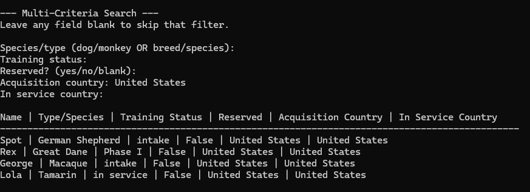

This artifact is from my IT-145 Foundation in Application Development class that I took about two years ago, with the added enhancements from software design and engineering. The concept of this project was that the company, Grazioso Salvare, uses dogs and monkeys as search and rescue animals, and put the animals in training prior to being in service. The enhancements that I made during the software design and engineering phase what rewriting the code in Python and implementing role-based access using username and passwords.  

I chose this single artifact for all three of my enhancements for my ePortfolio because I came to the conclusion that it would be the best one to use to effectively show my skills and complete the course outcomes for all five of the enhancements. Rather than making small enhancements across three different projects, I liked the idea of taking one project that was extremely simple and lacked security, logic, and long-term storage, and fixing these problems by the end of all the enhancements. The enhancements that I implemented throughout the algorithms and data structures phase focused on improving reservation logic, training status updates, as well as searching for animals. The course outcome that I met with this enhancement was design and evaluate computing solutions that solve a given problem using algorithmic principles and computer science practices and standards appropriate to its solution, while managing the trade-offs involved in design choices. These enhancements improve efficiency by introducing a dictionary-based name index that allows the system to check for duplicate animals and retrieve animals in constant time, rather than scanning entire lists as the number of animals increases. The multi-criteria search replaces the initial print functions that were in the previous version with a single reusable algorithm. Although the algorithm still searches through each animal, it allows for maintainability and will support scalability during the next enhancement when the multi-search criteria is moved to MongoDB queries and indexes to support scalability.   

## **Multi-Criteria Search**

## **View the Code Repositories**
- [Origional Version](https://github.com/GeraldineWhitaker/Original-Code)
- [Enhanced Version - Software Engineering and Design](https://github.com/GeraldineWhitaker/Software-Engineering-and-Design-Enhancement-)
- [Enhanced Version - Data Structures and Algoritms](https://github.com/GeraldineWhitaker/Data-Structures-and-Algorithms)

## **ePortfolio Links** 
- [Self Assessment and Code Review](index.html)
- [Software Engineering and Design Enhancement](Enhancement1.html)
- [Databases Enhancement](Enhancement3.html)
